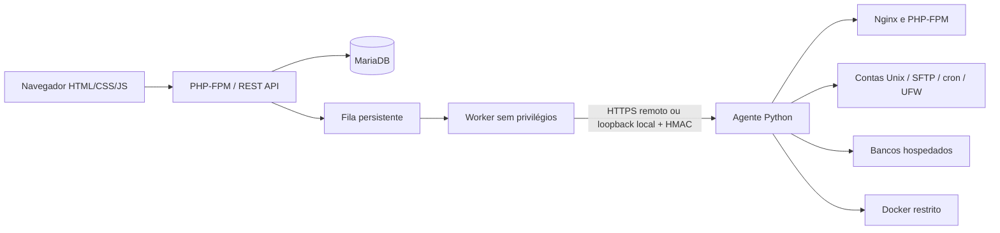

# Arquitetura

O processo PHP web não possui root e não executa comandos. O agente root aceita nomes de operação definidos em código, valida os campos e usa `subprocess` com listas de argumentos, sem shell. A fila usa credenciais criptografadas; o worker usa a mesma identidade de banco do painel.

Cada consulta de recursos usa tenant e conjunto de proprietários permitidos. MASTER e ADMIN operam dentro da própria organização; RESELLER inclui seus clientes diretos; CLIENT inclui somente o próprio ID. Um MASTER não atravessa tenants pelo navegador.

As FKs compostas `(tenant_id, id)` impedem vínculos entre organizações. O backend deriva tenant do usuário autenticado, nunca de um parâmetro do navegador. Permissões individuais são aplicadas sobre o perfil, e tokens usam a interseção entre permissões atuais e escopos concedidos.

As reservas de quantidade e a criação de jobs ocorrem na mesma transação. Uma trava na linha do tenant serializa o cálculo de quotas no MariaDB. SQLite usa `BEGIN IMMEDIATE` para testes e desenvolvimento.

Status: `pending → running → completed/failed` para jobs e `pending → active/failed` para recursos. Remoções passam por `deleting` e somente liberam a quantidade após sucesso. Falhas e respostas ambíguas não são convertidas em sucesso e não têm repetição destrutiva automática.

O agente persiste nonce e IDs de operação em SQLite próprio. Um ID usado com outro conteúdo é recusado. Operações interrompidas ficam bloqueadas para reconciliação. Isso evita repetição cega, mas não fornece transação distribuída nem rollback automático de todos os efeitos do sistema operacional.

Sites recebem usuário Unix e pool PHP próprio. Operações de arquivo e restauração são executadas em subprocesso com UID/GID do site e grupos suplementares removidos. O diretório é validado e links simbólicos são recusados. Essa separação ainda exige homologação Linux e reforço com quotas/cgroups antes de oferecer hospedagem de código hostil.

Métricas usam coleta periódica e Fetch a cada 30 segundos. WebSockets ficam reservados à futura implementação do terminal interativo, ainda não disponibilizada.
